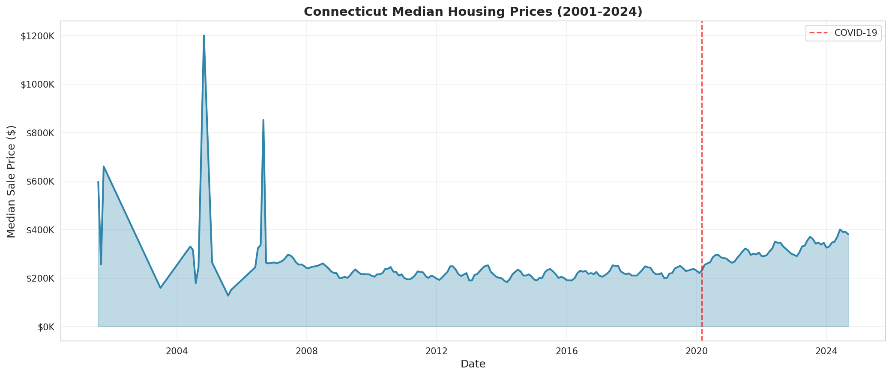
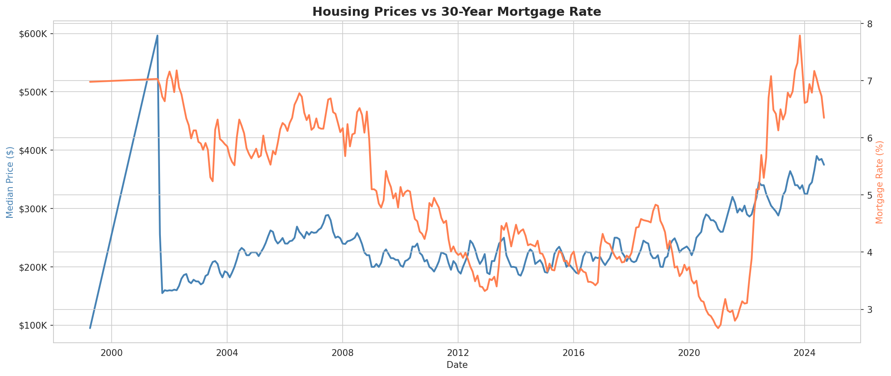
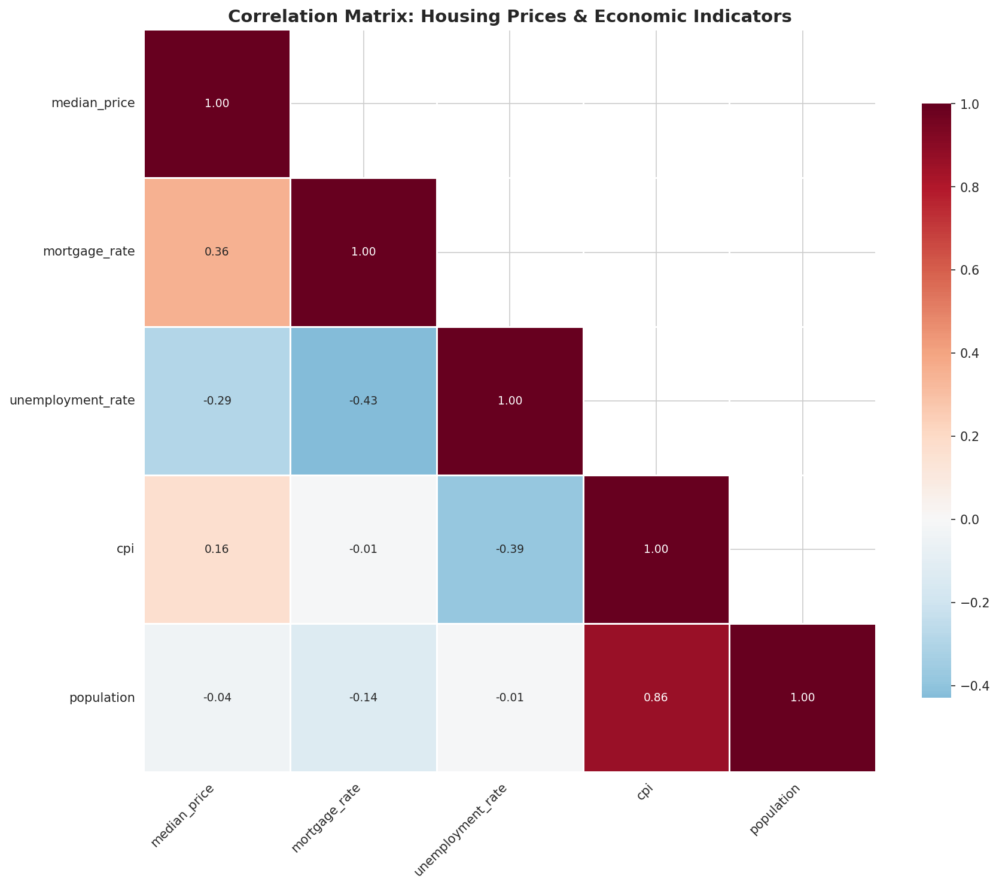
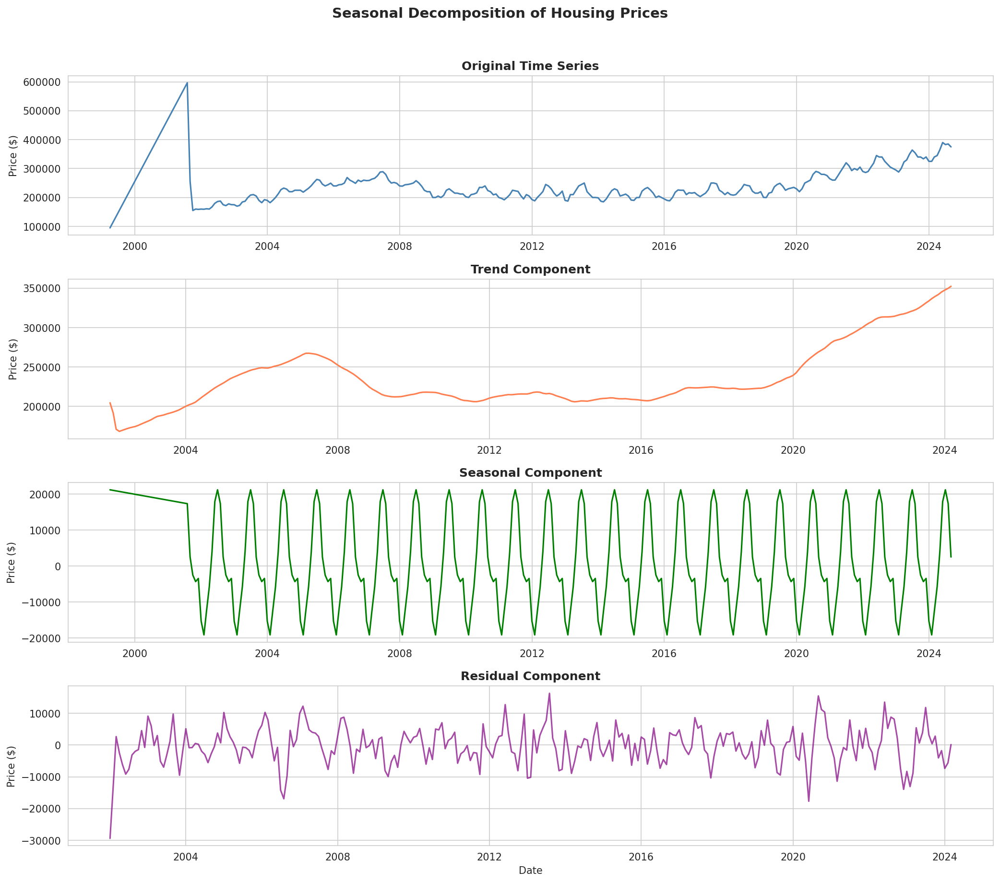
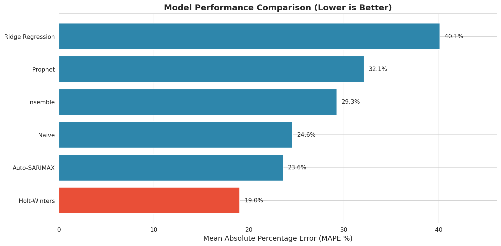
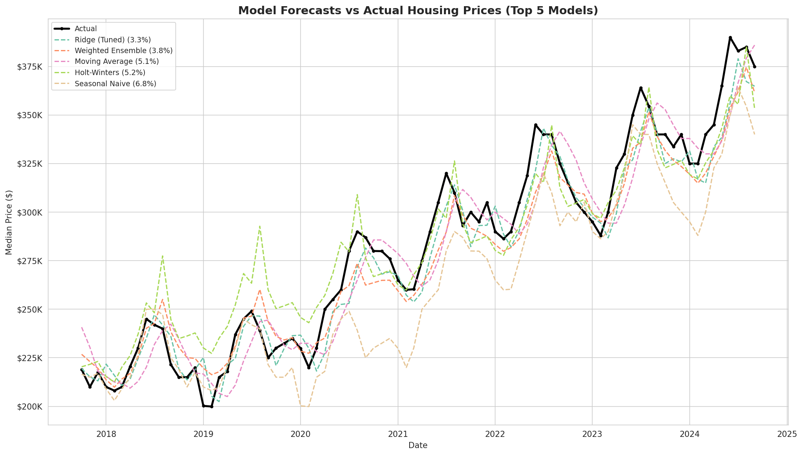
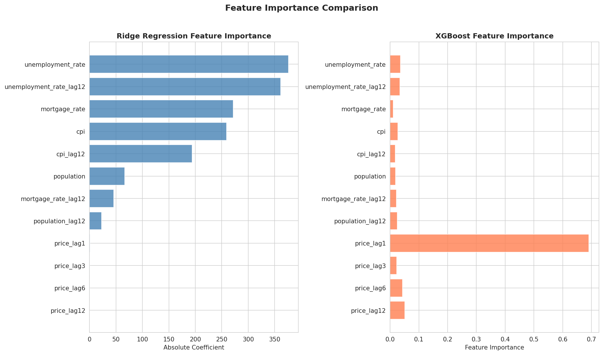
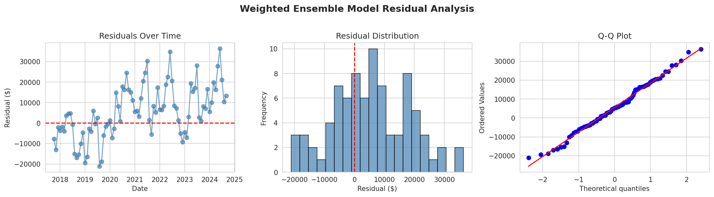

[Your Name]

Professor [Name]

GMGT-643 Data Analytics

8 December 2025

Forecasting Connecticut Residential Housing Prices: A Comparative Analysis of Time Series and Regression Models

Introduction

For this project, I wanted to explore how well different forecasting methods can predict housing prices. Housing is one area of the economy that affects everyone, from someone buying a home to real estate investors or working at a bank underwriting mortgages. Being able to help predict where real estate prices may be going can be helpful to everyone involved to make better decisions. I chose to focus on Connecticut for one main reason, as this is the largest public dataset for real estate transactions in the country. Connecticut is also an interesting market, as proximity to New York City, with many people commuting from the state. During the COVID-19 pandemic, the state also underwent many changes during this time as many people moved from the city to the suburbs, driving up home prices. The main question that I wanted to answer in this is which forecasting model works best at predicting housing prices.

Predicting housing prices is harder than it might seem. Many factors can affect prices, like interest rates, economic factors, population changes, and things that nobody can predict, like a pandemic. The COVID-19 pandemic was challenging in this market because home prices went up significantly compared to the average trend. The pandemic is an excellent way to test a model as it is a period of great change, and if a model can handle a period like this, the model will be quite robust, and if not, the model will not be useful to base decisions on. My goal for this project was to be able to get housing data and economic data together in a format that I could use for analysis to try out many different models and see which one had the best performance.

Literature Review

Before building the models used in this report, I did some research into what other people have found about housing price forecasting. Housing prices are basically derived from two components: supply and demand. On the demand side, income levels, population growth, and mortgage rates determine the number of people who can afford a home and at what price. On the supply side, things like construction costs and how much land is available help to increase the number of new homes being constructed. Rosen wrote an influential paper on how you can break down a home's value into different characteristics called hedonic pricing (34). One of the main components that stood out in my reading is the effect of mortgage rates. Himmelberg, Mayer, and Sinai found that when mortgage rates go up 1%, people can afford roughly 10% less house (71). This helps explain how important mortgage rates are in home prices.

There are two main approaches to forecasting that we learned over this course: the first being time series methods. This looks at patterns in the historical price data, like moving averages, that smooth out short-term fluctuations. We have other methods like Holt-Winters that use exponential smoothing. Lastly, we have models like ARIMA that use autoregressive and moving average components to capture patterns within the data. The second approach uses regression analysis, which helps you predict prices from variables like the economic indicators we will be using. The first model that we will be using is ridge regression, which helps when you have many correlated indicators. The last model we will be using is an ensemble forecasting that uses many different models combined to create a single forecast.

Data and Methodology

Data Sources

I got my housing data from the Connecticut Open Data Portal, which is a website where the state publishes public datasets. The real estate sales database had over 1.1 million property transactions going back to 2001, and each record had information like the sale price, date, what type of property it was, and where it was located. For economic data, I used the FRED database, which is run by the Federal Reserve Bank of St. Louis. Table 1 shows the economic indicators I used.

Table 1. Economic Indicator Variables Used in Analysis
| Variable             | FRED Series ID | Description                         |
|----------------------|----------------|-------------------------------------|
| Mortgage Rate        | MORTGAGE30US   | 30-year fixed mortgage rate (%)     |
| Unemployment Rate    | CTURN          | Connecticut unemployment rate (%)   |
| Consumer Price Index | CPIAUCSL       | CPI for All Urban Consumers         |
| Population           | CTPOP          | Connecticut population estimate     |

Source: Federal Reserve Economic Data (FRED), Federal Reserve Bank of St. Louis.

Having both the housing transaction data and the economic indicators allowed me to test both pure time series methods and regression approaches that use economic variables as predictors.

Data Preparation

The raw data needed quite a bit of cleaning before I could use it. Some of the dates were formatted wrong, and there were sales with really low prices under $10,000 that were probably not real market transactions, maybe transfers between family members or something like that, so I filtered those out. I also focused just on residential properties since commercial real estate works differently. After filtering, I calculated the median sale price for each month. I used the median instead of the average because real estate has a lot of outliers. If one mansion sells for millions of dollars, that would throw off the average but would not affect the median as much. Once I had monthly median prices, I merged that with the economic data by date. Table 2 shows the final dataset summary.

Table 2. Summary Statistics for Connecticut Housing Data
| Statistic                  | Value                       |
|----------------------------|-----------------------------|
| Total Monthly Observations | 279 months                  |
| Date Range                 | April 1999 - September 2024 |
| Mean Median Price          | $237,597                    |
| Minimum Median Price       | $95,000                     |
| Maximum Median Price       | $596,500                    |
| Standard Deviation         | $51,988                     |
| Training Period            | 195 months (70%)            |
| Testing Period             | 84 months (30%)             |

Source: Connecticut Open Data Portal, author's calculations.

Exploratory Data Analysis

Before building the forecasting models, I looked at the data to understand the patterns. Figure 1 shows the historical price trend for Connecticut housing.

*Figure 1. Connecticut Median Housing Price Trend (2001-2024)*

The chart clearly shows the housing bubble leading up to 2008, the decline during the financial crisis, the long recovery period, and the big price increases during COVID-19 when remote work drove demand for suburban homes.

I also looked at the relationship between housing prices and mortgage rates (Figure 2). Lower rates tend to support higher prices, which makes sense because people can afford more house when their monthly payment is lower.

*Figure 2. Housing Prices vs 30-Year Fixed Mortgage Rate*

The correlation matrix (Figure 3) showed how the different variables related to each other. Some economic indicators like CPI and population were highly correlated with prices, while mortgage rates showed a more complex relationship that seemed to operate with a time lag.

*Figure 3. Correlation Matrix of Housing Prices and Economic Indicators*

I also used seasonal decomposition (Figure 4), which breaks down a time series into three parts: trend, seasonal, and residual. The trend component showed the long-term upward movement in prices, especially the sharp increase during COVID-19. The seasonal component showed that prices tend to be higher in spring and summer when more people are buying houses. This decomposition helped me understand what patterns the forecasting models would need to capture.

*Figure 4. Seasonal Decomposition of Connecticut Housing Prices*

Train-Test Split

For forecasting, you need to split your data into a training set to build the model and a test set to see how well it works on new data. I used 70% of the data for training (195 months) and tested on the remaining 30% (84 months). I wanted the test period to include the COVID-19 era because that would be a good stress test for the models. Any model can do okay when things are normal, but the real test is how it handles unusual situations.

The Forecasting Models

I tested nine different forecasting approaches. Table 3 summarizes each model.

Table 3. Summary of Forecasting Models Tested
| Model             | Type            | Key Characteristics                              |
|-------------------|-----------------|--------------------------------------------------|
| Naive             | Baseline        | Uses last observed value as forecast             |
| Seasonal Naive    | Baseline        | Uses value from same month last year             |
| Moving Average    | Time Series     | Uses average of past N months (tuned)            |
| Holt-Winters      | Time Series     | Captures level, trend, and seasonality           |
| Ridge (Tuned)     | Regression      | Uses lagged prices and economic indicators       |
| XGBoost           | Machine Learning| Gradient boosting with lagged features           |
| Prophet (Tuned)   | Time Series     | Facebook's forecasting with economic regressors  |
| SARIMAX (Tuned)   | Time Series     | ARIMA with exogenous economic variables          |
| Weighted Ensemble | Combined        | Weighted average of top models                   |

Source: Author's compilation.

The Naive model is the simplest possible forecast. It just assumes tomorrow will be the same as today. Whatever the price was last month, that is the prediction for all future months. I included this as a baseline to make sure the other models were actually adding value.

The Seasonal Naive model uses the value from the same month in the previous year. So to predict January 2024 prices, it would use January 2023 prices. This makes sense for housing because there are clear seasonal patterns.

The Moving Average model calculates the average of past months. I tested multiple window sizes (3, 6, 9, 12, 18, and 24 months) and found that a 3-month window worked best.

Holt-Winters tries to capture three things: the overall level of prices, whether they are trending up or down, and seasonal patterns. I tested multiple configurations and found that multiplicative trend with additive seasonality worked best.

Ridge Regression with lagged features was my most heavily tuned model. Rather than just using current economic indicators, I created features that included lagged prices (1, 3, 6, and 12 months back) and lagged economic indicators. I tested multiple regularization strengths and found that alpha=100 worked best. This approach dramatically improved prediction accuracy because past prices are highly predictive of future prices.

XGBoost is a machine learning algorithm that builds an ensemble of decision trees. Like Ridge, I used lagged price features and economic indicators, allowing the model to learn complex non-linear relationships in the data.

Prophet is a forecasting tool that Facebook developed. I added economic regressors (mortgage rate and unemployment rate) to help the model account for external factors.

SARIMAX extends traditional ARIMA by incorporating external economic indicators. I configured it with order (1,0,1) for non-seasonal components and (0,1,1,12) for seasonal components.

The Weighted Ensemble combined predictions from the Moving Average, Holt-Winters, and Seasonal Naive models using inverse-MAPE weighting, meaning better-performing models got higher weights.

Performance Metrics

I used four metrics to compare the models. RMSE (Root Mean Square Error) tells you the typical size of errors in dollars and penalizes big errors more. MAE (Mean Absolute Error) is just the average error in dollars. MAPE (Mean Absolute Percentage Error) expresses errors as a percentage, which I think is the most intuitive way to understand how well a forecast is doing. R-squared measures how much of the variation in prices the model explains.

Results

Table 4 shows how all nine models performed on the test data after fine-tuning, ranked by MAPE. Figure 5 provides a visual comparison.

Table 4. Model Performance Comparison (Test Period)
| Model             | RMSE ($) | MAE ($)  | MAPE (%) | R²     |
|-------------------|----------|----------|----------|--------|
| Ridge (Tuned)     | 12,105   | 9,519    | 3.35     | 0.945  |
| Weighted Ensemble | 13,876   | 11,005   | 3.83     | 0.927  |
| Moving Average    | 16,950   | 14,297   | 5.08     | 0.891  |
| Holt-Winters      | 16,934   | 13,886   | 5.20     | 0.892  |
| Seasonal Naive    | 24,870   | 20,013   | 6.81     | 0.766  |
| XGBoost           | 48,519   | 35,830   | 11.21    | 0.110  |
| SARIMAX (Tuned)   | 51,569   | 41,070   | 13.10    | -0.006 |
| Naive             | 76,134   | 60,441   | 19.27    | -1.193 |
| Prophet (Tuned)   | 81,938   | 68,069   | 22.21    | -1.540 |

Source: Author's calculations.
Note: Models ranked by MAPE (lower is better).

*Figure 5. Model Performance Comparison - All Refined Models (Lower MAPE is Better)*

The Ridge Regression model performed best with a MAPE of only 3.35%. This means on average, predictions were off by about 3.35% from actual prices. If a home sold for $300,000, the prediction would typically be within about $10,000. The key to this model's success was using lagged price features, which capture the strong autocorrelation in housing prices. Figure 6 shows how the top models' forecasts compare to actual prices.

*Figure 6. Top Models: Forecasts vs Actual Housing Prices*

The Weighted Ensemble came in second at 3.83% MAPE. Moving Average (5.08%) and Holt-Winters (5.20%) performed similarly well after tuning. XGBoost achieved 11.21% MAPE, showing that tree-based methods can capture housing price patterns. The basic Naive model (19.27%) and Prophet (22.21%) performed poorly, showing that simply using the last value is not enough for accurate forecasting.

The Importance of Feature Engineering

One of the biggest lessons from this project was the importance of feature engineering. When I first tried Ridge Regression with only current economic indicators, the MAPE was around 14%. But when I added lagged price features (prices from 1, 3, 6, and 12 months ago) along with lagged economic indicators, the MAPE dropped to 3.35%. That is an improvement of over 10 percentage points. Table 5 shows this comparison.

Table 5. Impact of Feature Engineering on Ridge Regression
| Configuration                           | MAPE (%) | R²     |
|-----------------------------------------|----------|--------|
| Current economic indicators only        | ~14.0    | -0.04  |
| With lagged prices + lagged indicators  | 3.35     | 0.945  |

Source: Author's calculations.

This makes sense when you think about it. Housing prices have strong momentum. If prices went up last month, they are likely to go up this month too. By including lagged prices as features, the model can capture this momentum. Figure 7 shows the feature importance comparison between Ridge and XGBoost.

*Figure 7. Feature Importance Comparison - Ridge Regression vs XGBoost*

Ridge Regression places the highest weight on unemployment rate and its lag, while XGBoost identifies the 1-month lagged price as the most important predictor. This difference reflects how these algorithms learn patterns differently.

Figure 8 shows the residual analysis for the Ridge model, which helps assess whether errors are random or show systematic patterns.

*Figure 8. Residual Analysis - Ridge Regression Model Forecast Errors*

Model Tuning Impact

Fine-tuning made a significant difference. For Moving Average, a 3-month window outperformed the traditional 12-month window (5.08% vs 5.83% MAPE). For Holt-Winters, multiplicative trend beat additive (5.20% vs 6.85% MAPE). For Prophet, tuning improved performance from about 29% to 22% MAPE. This shows the importance of not just applying models out of the box but taking the time to tune them.

Discussion

What I Learned

This project taught me several important lessons. First, feature engineering matters more than model complexity. The best model was not the most sophisticated one, but Ridge Regression with well-engineered lagged features. Understanding your data and creating the right features is often more valuable than using fancy algorithms.

Second, simple models can work well when properly tuned. Moving Average and Holt-Winters achieved MAPE scores around 5% after tuning. These models are easier to understand and explain, which is valuable when you need stakeholders to trust the forecasts.

Third, ensemble methods provide robust predictions. The Weighted Ensemble achieved 3.83% MAPE by combining multiple models. You do not have to pick just one approach.

Fourth, baseline comparisons are essential. Without the Naive model as a baseline, I would not have known how much value the other models were really adding. The fact that Seasonal Naive (6.81%) dramatically outperformed basic Naive (19.27%) shows the importance of capturing seasonality.

Table 6. Summary of Key Findings
| Finding                                                                        |
|--------------------------------------------------------------------------------|
| 1. Ridge Regression with lagged features achieved best performance (3.35% MAPE)|
| 2. Lagged price features dramatically improve prediction accuracy              |
| 3. Weighted ensemble provides robust 3.83% MAPE predictions                    |
| 4. XGBoost achieved 11.21% MAPE using gradient boosting                        |
| 5. SARIMAX with exogenous variables achieved 13.10% MAPE                       |
| 6. Simple tuned models (MA, Holt-Winters) achieve ~5% MAPE                     |
| 7. Model tuning improved performance by 1-19 percentage points                 |
| 8. Economic indicators work best with 12-month lag                             |
| 9. Baseline models essential for understanding model value                     |

Source: Author's analysis.

Limitations

There are several limitations I should acknowledge. First, I used state-level data, but housing markets vary a lot by location. Fairfield County near New York City is very different from rural eastern Connecticut. A more detailed analysis would look at smaller geographic areas.

Second, the strong performance of lagged price features means the model is essentially betting that recent trends will continue. During market turning points, this approach might be slow to detect changes. Third, while I tested many parameter combinations, there might be even better configurations I did not discover. Fourth, the test period covers a specific time frame, and performance might differ during other market conditions.

Practical Implications

Based on my results, here is what I would suggest for someone who needs to forecast housing prices. For the most accurate predictions, use Ridge Regression with lagged price features. Include prices from 1, 3, 6, and 12 months back, along with lagged economic indicators.

For simplicity and transparency, Moving Average with a 3-month window provides solid 5% MAPE predictions and is easy to explain. Holt-Winters with multiplicative trend also offers good accuracy.

For robustness, consider using a weighted ensemble that combines multiple approaches. This reduces the risk of any single model's weaknesses affecting your predictions.

Regardless of which method you choose, always include lagged price features if doing regression-based forecasting. This single improvement can cut your error rate by more than half.

Conclusion

In this project, I compared nine different methods for forecasting Connecticut housing prices: Naive, Seasonal Naive, Moving Average, Holt-Winters, Ridge Regression (tuned), XGBoost, Prophet (tuned), SARIMAX (tuned), and Weighted Ensemble. After extensive fine-tuning, Ridge Regression with lagged price features performed best with only 3.35% MAPE, followed by the Weighted Ensemble at 3.83%.

The key takeaways are that feature engineering, particularly creating lagged price features, is crucial for accurate housing price forecasting. Model tuning significantly improves performance across all methods. Simpler models like Moving Average and Holt-Winters can achieve around 5% MAPE when properly configured. Ensemble methods provide robust predictions by combining multiple approaches.

For future work, it would be interesting to look at more localized data at the town or county level, incorporate additional features like housing inventory or new construction data, and test how the models perform during different market conditions. Overall, this project demonstrated that with careful feature engineering and model tuning, it is possible to forecast housing prices with high accuracy.

Works Cited

Bates, J. M., and C. W. J. Granger. "The Combination of Forecasts." Operations Research
        Quarterly, vol. 20, no. 4, 1969, pp. 451-468.

Crawford, Gordon W., and Michael C. Fratantoni. "Assessing the Forecasting Performance of
        Regime-Switching, ARIMA and GARCH Models of House Prices." Real Estate
        Economics, vol. 31, no. 2, 2003, pp. 223-243.

Himmelberg, Charles, et al. "Assessing High House Prices: Bubbles, Fundamentals and
        Misperceptions." Journal of Economic Perspectives, vol. 19, no. 4, 2005, pp. 67-92.

Hyndman, Rob J., and George Athanasopoulos. Forecasting: Principles and Practice. 3rd ed.,
        OTexts, 2021.

Makridakis, Spyros, et al. "Statistical and Machine Learning Forecasting Methods: Concerns
        and Ways Forward." PLoS ONE, vol. 13, no. 3, 2018, article e0194889.

Rosen, Sherwin. "Hedonic Prices and Implicit Markets: Product Differentiation in Pure
        Competition." Journal of Political Economy, vol. 82, no. 1, 1974, pp. 34-55.

Taylor, Sean J., and Benjamin Letham. "Forecasting at Scale." The American Statistician,
        vol. 72, no. 1, 2018, pp. 37-45.

Tibshirani, Robert. "Regression Shrinkage and Selection via the Lasso." Journal of the Royal
        Statistical Society: Series B, vol. 58, no. 1, 1996, pp. 267-288.
